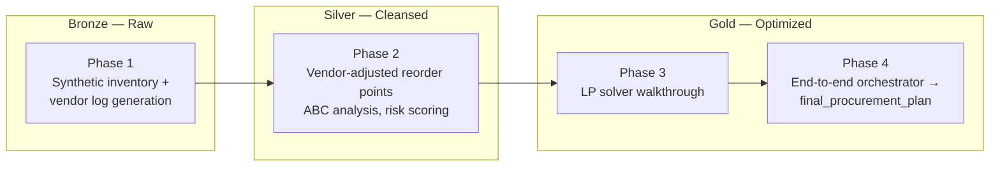

# Supply Chain Optimization Engine

**An end-to-end Databricks pipeline that turns raw inventory data into a budget-constrained procurement decision** — using PySpark for distributed data processing and a linear program (SciPy/HiGHS) for the final prescriptive call.

> Diagnoses which of 100,000 SKUs are at risk of stocking out, then mathematically decides how to spend a limited budget on the highest-risk items — including fixing a real LP bug along the way (see [Results](#results)).

---

## What This Actually Does

Most inventory dashboards stop at "here's what's low." This pipeline goes one step further: given a fixed budget, it decides **exactly how many units of which SKUs to order**, by solving a bounded linear program that weighs stock-out risk against cost-efficiency.

**What it is not:** a validated forecasting system. All demand, lead-time, and vendor data are synthetically generated — this project demonstrates the engineering and optimization mechanics end-to-end, not a production-validated business result. Full honesty on scope is in [`docs/Project_Documentation_and_Results.pdf`](docs/Project_Documentation_and_Results.pdf).

---

## Architecture



| Layer | Notebook | What happens |
|---|---|---|
| Bronze | `Phase_1_Data_Generation.ipynb` | Generates 100K inventory records + 100K vendor logs. `reorder_point` is *derived* from demand, lead time, and a safety-stock buffer — not random. |
| Silver | `Phase_2_Inventory_Transformation.ipynb` | Joins vendor reliability onto inventory to adjust reorder points; computes ABC categories and stock-out risk scores from real usage value. |
| Gold | `Phase_3_Optimization_Solver.ipynb` | Standalone walkthrough of the bounded LP — the core optimization logic, in isolation. |
| Gold | `Phase_4_Final_Project_Orchestrator.ipynb` | Runs the full pipeline end-to-end and writes `final_procurement_plan`. |

---

## Tech Stack

| Layer | Tool |
|---|---|
| Platform | Databricks (Community Edition / Serverless) |
| Data processing | PySpark (DataFrame API, Window functions) |
| Storage | Delta Lake |
| Optimization | SciPy `linprog` (HiGHS solver — dual/primal simplex, interior point) |
| Analysis / glue | Pandas, NumPy |
| Visualization | Plotly |
| Query layer | Spark SQL |

---

## Results

### The bug: a real LP failure mode, found and fixed
The first version of the solver only set a **lower bound** on order quantity (must cover the shortfall) with no upper bound. Since the LP's only way to spend leftover budget was to pour it into whichever single SKU had the best (but unconstrained) risk score, it concentrated **63% of the entire budget into one item**, wildly overstocking it while everything else got the bare minimum.

**Fix:** added a data-driven upper bound (`shortfall + 0.5 × reorder_point`) per item, and made the budget itself a function of the batch's floor and ceiling cost rather than a hardcoded number. Result:


*Real output from Phase 3 — 20 highest-risk items in the batch, before and after the solver runs. `risk_after` is computed exactly from `risk_before × current_stock / (current_stock + order_qty)`, no demand/lead-time terms needed since they cancel algebraically.*

### The budget-constrained solve


| Metric | Value |
|---|---|
| Batch size (highest-risk Category-A CRITICAL items) | 500 |
| Floor cost (cover every shortfall) | $110,737,017.48 |
| Chosen budget (30% headroom above floor) | $129,396,047.57 |
| Actual spend | $129,395,162.56 |
| **Largest single-item share of spend** | **0.5%** (was 63% before the fix) |
| Total stock-out risk reduction across batch | 90.51% |

Phase 3 (standalone demo) and Phase 4 (orchestrator) independently derive the *identical* budget from the same Gold table — confirming the logic is reproducible, not a one-off.

A sample of the real output rows is in [`results/sample_procurement_plan_top20.csv`](results/sample_procurement_plan_top20.csv).

---

## Honest Limitations

This project is deliberately documented with its own gaps rather than overselling them:

- All data is synthetic — there's no historical demand to backtest against.
- The optimizer solves for 500 of ~55,838 flagged items per cycle (a representative batch, not the full backlog — that batching loop isn't built yet).
- Budget headroom and buffer constants are reasonable defaults, not derived from a real service-level or holding-cost model.
- The ABC ranking step uses a global window function that's fine at 100K rows but wouldn't scale to millions without rework (documented in the code, not fixed).

Full write-up: [`docs/Project_Documentation_and_Results.pdf`](docs/Project_Documentation_and_Results.pdf)

---

## Project Structure

```
supply-chain-optimization-engine/
├── README.md
├── Phase_1_Data_Generation.ipynb
├── Phase_2_Inventory_Transformation.ipynb
├── Phase_3_Optimization_Solver.ipynb
├── Phase_4_Final_Project_Orchestrator.ipynb
├── results/
│   ├── risk_before_after.png
│   ├── budget_breakdown.png
│   └── sample_procurement_plan_top20.csv
└── docs/
    └── Project_Documentation_and_Results.pdf
```
